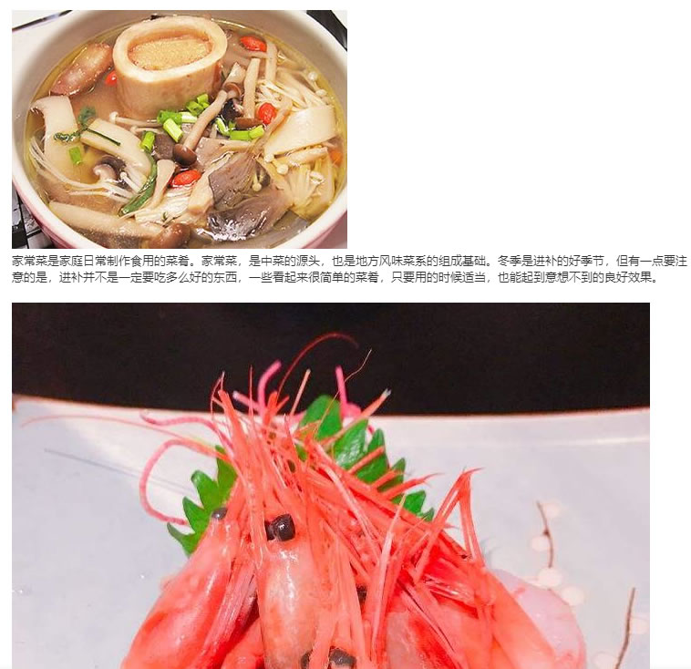
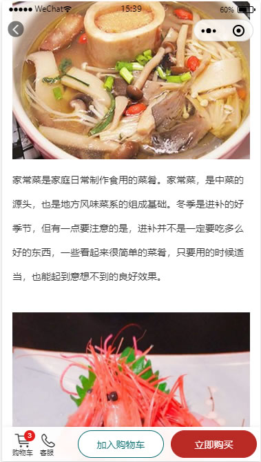

在小程序环境支持图文混排的渲染及自定义样式（uni-app）
===

> h5 环境直接使用 v-html 指令，或者通过 $ref 取得元素赋值 innerHTML 即可。

小程序环境，是禁止直接操作 DOM 的，而且在 uni-app 中使用 v-html 也会直接渲染成 rich-text 组件。渲染后会带来两个问题：

- v-html 将字符串解析成 rich-text 的 nodes 将会带来性能降低问题
- 无法直接操作 nodes 节点来设置自定义样式

为了解决以上问题，采取以下思路解决：
- 直接用 rich-text 组件来渲染图片混排内容
- 使用 [node-html-parser](https://www.npmjs.com/package/node-html-parser) 手动解析成 rich-text 风格的节点数组
- 在解析过程中对 rich-text 节点注入 class 或者 style 样式

### 1、编辑富文本
富文本工具，请自行解决，例如：
```html
<p></p>
<p>
  家常菜是家庭日常制作食用的菜肴。家常菜，是中菜的源头，也是地方风味菜系的组成基础。冬季是进补的好季节，但有一点要注意的是，
  进补并不是一定要吃多么好的东西，一些看起来很简单的菜肴，只要用的时候适当，也能起到意想不到的良好效果。
</p>
<p><br></p>
<p></p>
```

预览效果如下（来自于富文本编辑器）：


### 2、将 html 转换为 rich-text nodes（样式注入）
使用以下 parseHTML 方法来转换为 nodes
```js
// utils.js

import { parse } from 'node-html-parser';

/**
 * 解析 html 字符串为 node 结构
 * @param {String} html
 * @param {Function} transform
 * @param classNames 需要附加的类，如 {img:'goods-img border'}
 * @param styles 需要附加的样式，如 {img:'width:100%'}
 */
export function parseHTML(html, transform, classNames = null, styles = null) {
  return parse(html).childNodes.map(node => transform(node, classNames, styles));
}

export function transformRichTextNode(node, classNames = null, styles = null) {

  // 文本节点
  if (node.nodeType === 3) {
    return { type: 'text', text: node.text };
  }

  // 元素节点
  else {
    const tagName = node.tagName.toLowerCase();
    const attrs = { ...node.attributes };
    const richNode = {
      name: tagName,
      type: 'node',
      attrs,
      children: node.childNodes.map(item => transformRichTextNode(item, classNames, styles))
    };

    if (classNames && classNames[tagName]) {
      const src = stringToClass(richNode.attrs.class);
      const newClass = stringToClass(classNames[tagName]);
      richNode.attrs.class = [...src, ...newClass].join(' ');
    }

    if (styles && styles[tagName]) {
      const src = stringToAttrs(richNode.attrs.style);
      const newStyle = stringToAttrs(styles[tagName]);
      richNode.attrs.style = attrsToString({ ...src, ...newStyle });
    }

    return richNode;
  }

}

function stringToClass(names) {
  if (typeof names === 'string') {
    return names.split(/\s+/);
  }
  return names || [];
}

function stringToAttrs(attrs) {
  if (typeof attrs === 'string') {
    return attrs.split(';')
                .filter(item => item.length > 0)
                .map(item => {
                  return item.split(':');
                })
                .reduce((holder, item) => {
                  holder[item[0]] = item[1];
                  return holder;
                }, {});
  }

  return attrs || {};
}

function attrsToString(attrs) {
  return Object.keys(attrs)
               .map(key => `${key}:${attrs[key]}`)
               .join(';');
}

```

```vue
<template>
  <view>
    <rich-text :nodes="richTextNodes"></rich-text>
  </view>
</template>

<script>
import { parseHTML, transformRichTextNode } from './utils';

export default {
  data() {
    // html（一般从后台接口取得）
    html: `<p></p><p>家常菜是家庭日常制作食用的菜肴。家常菜，是中菜的源头，也是地方风味菜系的组成基础。冬季是进补的好季节，但有一点要注意的是，进补并不是一定要吃多么好的东西，一些看起来很简单的菜肴，只要用的时候适当，也能起到意想不到的良好效果。</p><p><br></p><p></p>`,

    // 商品图文介绍需要设置的样式
    richStyle: {
      img: 'width:100%;height:auto;', // 图片自适应容器宽度
      p: 'line-height:2.5' // 文本 2.5 倍行距
    }
  },

  computed: {
    richTextNodes() {
      return parseHTML(this.html, transformRichTextNode, null, this.richStyle);
    }
  }
}
</script>
```

最终效果类似于以下所示：

